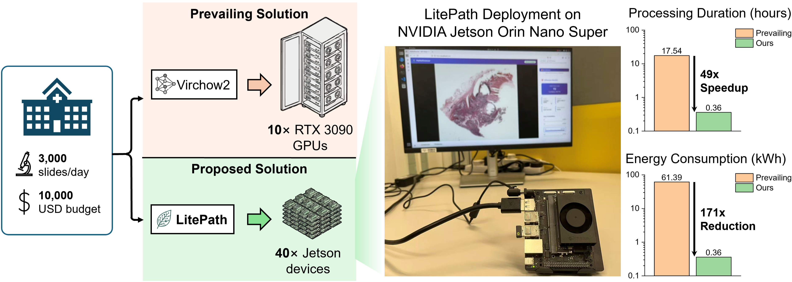
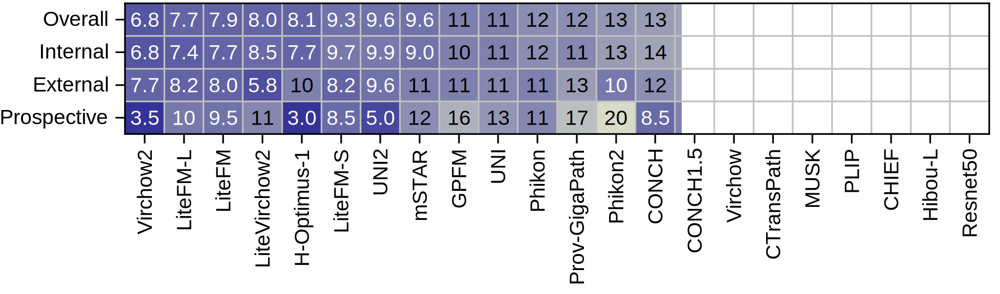

We present **LitePath**, a framework designed to mitigate model over-parameterization and patch‑level redundancy. LitePath integrates **LiteFM**, a compact model distilled from three large PFMs (Virchow2, H-Optimus-1 and UNI2) using 190 million patches, and the **Adaptive Patch Selector (APS)**, a lightweight modular component for task-specific patch selection. 


## Features

- ⚡ **High Efficiency in Computational Pathology**</br>
  **28x smaller** and **105x faster** compared to Virchow2.

- 🎯 **State-of-the-Art Accuracy**</br>
  Deliver performance on par with leading pathology foundation models, maintaining a **99.71% average AUC retention** compared to Virchow2.

- 🌍 **Friendly for Edge Deployment**</br>
  Easily deployable on various edge devices, such as NVIDIA Jetson Orin Nano Super with **25W rated power**.


<p align="center"></p>


<p align="center"></p>


## Project Structure

```
LitePath/
├── distillation/          # Knowledge distillation training of LiteFM
├── diagnosis_prediction/  # Downstream task training and evaluation
├── inference/            # Deployment and inference
└── README.md
```


## Requirements

### System Requirements

- Python >= 3.10
- CUDA >= 12.1 (12.9 recommended)

### Installation

**1. Install PyTorch with CUDA support:**

```bash
pip install torch==2.3.1 torchvision==0.18.1 --index-url https://download.pytorch.org/whl/cu121
```

> **Note:** For CUDA 12.9, use `cu121` or `cu124` index (backward compatible)

**2. Install other dependencies:**

```bash
pip install -r requirements.txt
```

### Main Dependencies

- **PyTorch Ecosystem**: torch==2.3.1, torchvision==0.18.1
- **Deep Learning**: timm==1.0.15, pytorch-lightning==2.4.0, torchmetrics==1.6.0
- **Computer Vision**: opencv-python==4.10.0.84, Pillow==9.5.0
- **WSI Processing**: [ASlide](https://github.com/MrPeterJin/ASlide) (from GitHub)
- **Data Processing**: numpy==2.2.6, pandas==2.2.3, h5py==3.13.0, lmdb>=1.4.0
- **Machine Learning**: scikit-learn==1.7.0, scipy==1.14.1
- **Experiment Tracking**: wandb==0.18.7
- **Hugging Face**: huggingface-hub==0.36.0, transformers==4.50.3

For the complete list of dependencies, see [requirements.txt](./requirements.txt).


## Quick Start

### Download and extract required files

Download the checkpoint files and examples, then extract them into the `inference/` directory:

```bash
# Download checkpoints
wget https://github.com/caiyu6666/LitePath/releases/download/v1.0.0/ckpts.zip
# Download examples
wget https://github.com/caiyu6666/LitePath/releases/download/v1.0.0/examples.zip

# Extract to inference/ directory
cd inference/
unzip ../ckpts.zip
unzip ../examples.zip
```


### Lightweight Patch Feature Extractor

Example Python code to extract patch features:

```python
from models import get_model
import torch

device = torch.device('cuda')
x = torch.randn(1, 3, 224, 224).to(device)
model = get_model('LiteFM', device)
feat = model(x)
print(feat.shape)
```

### Efficient PFM framework

To learn how to use the LitePath framework in a practical case, refer to the provided Jupyter Notebook: [example.ipynb](./inference/example.ipynb).


## Usage

### Stage 1: Distillation Pretraining of LiteFM

**Navigate to the `distillation` directory:**

```bash
cd distillation/
```

**1. Extract teacher features and store them to disk**

```bash
# Use DDP to speed up feature extraction:
python extract_features_ddp.py
# Merge extracted features into a single file:
python merge_features.py

### Alternative: Running on SLURM
sbatch slurm/feature_preparation/extract.slurm
```

**2.  Train LiteFM using the configuration file**

```bash
python train_lite_fast.py --config configs/litefm.yaml

### Alternative: Running on SLURM
sbatch slurm/model_training/litefm.slurm
```

- `configs/litefm.yaml` contains hyperparameters and training configuration. Modify it as needed to fit your setup.


### Stage 2: ABMIL Training and Evaluation

**Navigate to the `diagnosis_prediction` directory:**

```bash
cd diagnosis_prediction/
```

**1. Use [PrePath](https://github.com/birkhoffkiki/PrePATH) to extract the `LiteFM` features required for training and evaluation. (Our model has been integrated into PrePath.)**

**2. Train and evaluate ABMIL**

```bash
bash scripts/classification.sh
```

**3. Optional: Ablation on inference with partial patches (topk & uniformk)**

```bash
bash scripts/topk.sh
```


### Stage 3: APS Training and Evaluation

**Navigate to the `diagnosis_prediction` directory:**

```bash
cd diagnosis_prediction/
```

**1. Use [PrePath](https://github.com/birkhoffkiki/PrePATH) to extract the `LiteFM-block0` features. Here, `LiteFM-block0` refers to the intermediate shallow features from the first Transformer block**

**2. Train the APS Scoring Network**

```bash
bash scripts/aps.sh
```

**3. Grid search the optimal selection number for each task**

```bash
bash scripts/aps_gridsearch.sh
```

**4. Update the optimal selection number in `datasets/selection.json`.**

**5. Evaluate with the configuration in `selection.json`**

```bash
bash scripts/aps.sh
```

(The code will automatically scan the well-trained `ckpt` and `json` files)


## Model Variants

| **Model Name**           | **Backbone** | **#Params.** | **Teachers**                |
| ------------------------ | ------------ | ------------ | --------------------------- |
| **LiteFM (Recommended)** | ViT-S        | 22.06M       | Virchow2, H-Optimus-1, UNI2 |
| LiteFM-L                 | ViT-B        | 86.59M       | Virchow2, H-Optimus-1, UNI2 |
| LiteVirchow2             | ViT-S        | 22.06M       | Virchow2                    |
| LiteFM-S                 | ViT-Ti       | 5.72M        | Virchow2, H-Optimus-1, UNI2 |

<p align="center"></p>


## Acknowledgements

The work was built on top of repositories including: [ASlide](https://github.com/MrPeterJin/ASlide), [PrePath](https://github.com/birkhoffkiki/PrePATH), [mSTAR](https://github.com/Innse/mSTAR), [GPFM](https://github.com/birkhoffkiki/GPFM). We thank the original authors for their excellent work!

If any questions, feel free to email [Yu Cai](mailto:yu.cai@connect.ust.hk)

